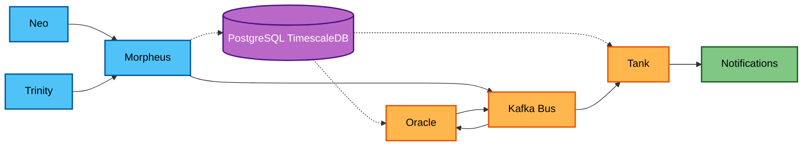

# Matrix - Financial Data Processing Pipeline

A comprehensive financial data processing and alerting system built with microservices architecture following clean design principles.

## 🏗️ Architecture Overview

Matrix is composed of five specialized microservices that work together to collect, process, analyze, and alert on financial market data:



## 🚀 Services

### 🟢 Neo - Stock Price Collector
**Purpose**: Collects real-time stock market prices and sends them to Morpheus via gRPC

**Features**:
- Fetches stock prices from multiple exchanges (Bitstamp, Kraken, etc.)
- Real-time data collection with configurable intervals
- gRPC communication with Morpheus

**Tech Stack**: Go, gRPC, HTTP clients

---

### 🔵 Trinity - News Collector
**Purpose**: Collects relevant financial news and market information, sending them to Morpheus via gRPC

**Features**:
- Aggregates news from multiple financial sources
- Filters and categorizes market-relevant news
- Real-time news streaming
- gRPC communication with Morpheus
- Content analysis and relevance scoring

**Tech Stack**: Go, gRPC, News APIs

---

### 🟣 Morpheus - Data Ingestion & Event Hub
**Purpose**: Receives data from Neo and Trinity, stores in PostgreSQL TimescaleDB, and generates events on Kafka bus

**Features**:
- High-performance gRPC server for data ingestion
- PostgreSQL TimescaleDB for time-series data storage
- Kafka event publishing for real-time data streams
- Data validation and normalization
- Horizontal scaling capabilities

**Tech Stack**: Go, gRPC, PostgreSQL TimescaleDB, Kafka

---

### 🟠 Oracle - Analytics & Alert Engine
**Purpose**: Consumes price/news update events and performs comprehensive analytics to generate various alert types

**Alert Types**:
- **Price Movements**: Sudden drops, rapid increases, trend changes
- **Technical Analysis**:
  - Fibonacci extension entries
  - Fibonacci regression entries
  - Support/resistance breakouts
- **News Analysis**: News confirms trends, new relevant news impact
- **Multi-Timeframe Analysis**: 5min, 1h, 1d, and custom intervals

**Features**:
- Real-time stream processing from Kafka
- Multiple timeframe analysis engines
- Advanced technical indicators
- News sentiment correlation
- Alert prioritization and filtering
- Sends notification requests to Tank via Kafka

**Tech Stack**: Python, Kafka, Time-series analysis, Technical indicators, NLP libraries

---

### 🔴 Tank - Notification Gateway
**Purpose**: Receives notification requests and handles delivery through appropriate channels

**Features**:
- Multi-channel notification delivery (Email, Slack, Telegram, SMS, Webhooks)
- User preference management
- Delivery confirmation and retry logic
- Rate limiting and spam protection
- Notification templates and customization

**Tech Stack**: To Be defined, Kafka, Various notification APIs

## 🛠️ Development Setup

> ⚠️ **Work in Progress**: The automated setup, build scripts, and some services are currently under development.

### Prerequisites
- Docker and Docker Compose
- PostgreSQL TimescaleDB
- Apache Kafka

### Getting Started

> 🚧 **Note**: Complete setup instructions will be available soon. Current implementation status:
> - ✅ Neo (Price collector) - Basic implementation available
> - 🚧 Morpheus (Data hub) - Under development
> - ✅ Trinity (News collector) - Planned
> - ⏳ Oracle (Analytics) - Planned
> - ⏳ Tank (Notifications) - Planned

1. **Clone the repository**
   ```bash
   git clone https://github.com/carlosgab83/matrix.git
   cd matrix
   ```

2. **Run available services**
   ```bash
   # Currently available for testing:

   # Neo & Morpheus (Price collector) - Works with Docker
   cd go && docker run --rm -it -v $(pwd):/app -w /app neo:latest bash cmd/nm.bash

   # Other services coming soon...
   ```

## 🏛️ Architecture Principles

### Communication Patterns
- **Synchronous**: gRPC for real-time data ingestion (Neo/Trinity → Morpheus)
- **Asynchronous**: Kafka for event-driven processing (Morpheus → Oracle → Tank)
- **Database**: PostgreSQL TimescaleDB for efficient time-series storage

### Observability
- Structured logging across all services
- Metrics collection for monitoring
- Distributed tracing for request flows
- Health checks and readiness probes

## � Data Flow

1. **Collection**: Neo collects stock prices, Trinity collects news
2. **Ingestion**: Both services send data to Morpheus via gRPC
3. **Storage**: Morpheus stores data in TimescaleDB and publishes events to Kafka
4. **Analysis**: Oracle consumes events, performs multi-timeframe analytics
5. **Alerting**: Oracle generates alerts and sends notification requests to Kafka
6. **Delivery**: Tank consumes notification requests and delivers through appropriate channels

## 🚦 Status

This project is currently under active development

## 📝 License

This project is licensed under the Creative Commons Attribution-NonCommercial 4.0 International License - see the [LICENSE](LICENSE) file for details.

### CC BY-NC 4.0 License

**You are free to:**
- ✅ **Share** — copy and redistribute the material in any medium or format
- ✅ **Adapt** — remix, transform, and build upon the material for non-commercial purposes

**Under the following terms:**
- 📝 **Attribution** — You must give appropriate credit and indicate if changes were made
- 🚫 **NonCommercial** — You may not use the material for commercial purposes

This is a learning project and is intended for educational and personal use only. Commercial use requires explicit permission from the author.

For more details, visit: [Creative Commons BY-NC 4.0](http://creativecommons.org/licenses/by-nc/4.0/)

